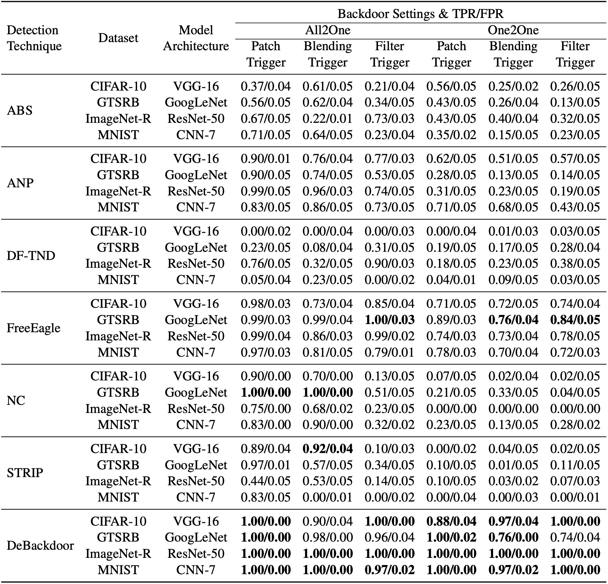

# DeBackdoor: A Deductive Framework for Detecting Backdoor Attacks on Deep Models with Limited Data

This repository is the official implementation of DeBackdoor: A Deductive Framework for Detecting Backdoor Attacks on Deep Models with Limited Data.

Given a model, we generate a backdoor trigger. A distinctive characteristic of backdoors is that they have high Attack Success Rate (ASR). We exploit this characteristic as an objective to generate triggers that maximize ASR. ASR is a discrete metric, and is therefore hard to optimize. To overcome this, we use a proxy version of ASR that is continuous (cASR).

Our generative process for optimizing a backdoor trigger is outlined below. We generate a trigger with high cASR, and we can see it is identical to the trigger that was injected by the attacker. Thus, we have detected the model is backdoored. In contrast, clean models are characterized by low scoring triggers, as they do not have an injected backdoor vulnerability.

<p align="center"></p>

## Requirements

To create virtual environment:

```
python -m venv env
```

To activate virtual environment:
```
source env/bin/activate
```

To install requirements:
```
pip install -r requirements.txt
```

## Detection

To run the detector:
```
python detector.py -m <path_to_model> -i <path_to_images> -n <number_of_rounds> -l <lambda_parameter> -a <attack_type> -s <patch_size_limit> -g <gpu_id>
```

We have included [examples](examples) of backdoor models (CNNs, WideResNets, ViTs), different trigger types (patch, blended, WaNet, LIRA, and semantic triggers), and clean validation images (CIFAR-10, GTSRB, MNIST, ImageNet). The patch and blended attacks are from the Trojan Detection Challenge NeurIPS 2022 [repository](https://github.com/mmazeika/tdc-starter-kit). The warping attack is implemented using code from the official WaNet [repository](https://github.com/VinAIResearch/Warping-based_Backdoor_Attack-release). The learning-based attack is implemented using code from the official LIRA [repository](https://github.com/khoadoan106/backdoor_attacks). The semantic attack is implemented using code from the official FreeEagle [repository](https://github.com/FuChong-cyber/Data-Free-Neural-Backdoor-Detector-FreeEagle). The mutliple trigger attacks (MMS-BD, [c-BaN](https://github.com/AhmedSalem2/Dynamic-Backdoor)) use patch triggers and are treated as such by DeBackdoor.

To inspect a model for patch attacks:
```
python detector.py -m examples/patch/mnist/model.pt -i examples/images/mnist.pt -n 30000 -l 0.9 -a patch -s 6 -g 0
```
python detector.py -m ../../../models/GTSRB_badnets.pth  -n 10000 -l 0.9 -a patch -s 6 -g 0 --with_labels

To inspect a model for blended attacks:
```
python detector.py -m examples/blend/mnist/model.pt -i examples/images/mnist.pt -n 30000 -l 0.9 -a blend -g 0
```

To inspect a model for filter attacks:
```
python detector.py -m examples/filter/mnist/model.pt -i examples/images/mnist.pt -n 30000 -l 0.9 -a filter -g 0
```

To inspect a model for WaNet attacks:
```
python detector.py -m examples/wanet/mnist/model.pt -i examples/images/mnist-wanet.pt -n 30000 -l 0.9 -a wanet -g 0
```

To inspect a model for LIRA attacks:
```
python detector.py -m examples/lira/mnist/model.pt -i examples/images/mnist-lira.pt -n 30000 -l 0.9 -a lira -g 0
```

To inspect a model for semantic attacks:
```
python detector.py -m examples/semantic/imagenet/model.pt -i examples/images/imagenet.pt -n 30000 -l 0.9 -a semantic -g 0
```

## Results

We evaluate our detection technique on 5,400 models, with even splits between clean/backdoor models, including CNNs, ResNets, Wide-ResNets, Vision Transformers, VGGs, and GoogLeNets trained on CIFAR-10/CIFAR-100/GTSRB/ImageNet/MNIST datasets. The patch and blended models can be obtained from the Trojan Detection Challenge NeurIPS 2022 [repository](https://github.com/mmazeika/tdc-starter-kit). The filter, WaNet, LIRA, semantic, MMS-BD, and c-BaN models can be obtained by using the code from their official repositories (listed above).

Our results are obtained by running our detection script for each of these models and compiling the scores of the highest scoring triggers for each model. The breakdown of the detection performance of our technique is summarized below.

<p align="center"></p>

For 7 out of 8 configurations along the x-axis, the separation is perfect and the area under ROC curve for classification is 1. For the last configuration (patch attack on MNIST), the area under ROC curve drops to 0.9.

We investigated and found that the sources of this error are large triggers. This problem arises in clean CNNs trained on MNIST data because the images of digits are simple, hence a large patch can be easily crafted to cover up and make one digit look like another (e.g., an 8 to a 9). These patches can be highly effective triggers and yield false positives (i.e., clean models with high-scoring triggers), thus lowering the area under ROC curve.

Even though the model performs perfectly for the first 7 configurations, the gap for blended attacks is larger. This means that blended attacks are generally easier to spot. This aligns with our hypothesis, as patch attack form a combinatorial search space, while the search space for blended attacks is continuous, and thus easier to search.

<p align="center"></p>

For dynamic attacks, the separation is perfect and the area under ROC curve for classification is 1 for all configurations. This is because the search space of triggers is highly continuous and thus much faster to search.

We note that for the fourth and fifth configuration, the scores of backdoored models are slightly lower. This happens due to our detection technique approximating the LIRA attack using a blended trigger. For MNIST (last configuration), this approximation is effective as the sample-specific noise trigger is uniform across samples due to the simplicity of the data. For CIFAR-10 and GTSRB, the data is more complex and thus the sample-specific noise is more diverse, making its approximation less effective.

<p align="center"></p>

For attacks that target multiple models or employ multiple triggers, we observe that DeBackdoor can effectively detect the backdoor across different numbers of targeted models/injected triggers. In fact, increasing the number of injected triggers makes detection easier as the attack has a larger footprint and the defender only has to find one of these triggers to detect the backdoor.

To provide a comprehensive evaluation of detection, we also compare DeBackdoor to a range of Post-Deployment, Data-Available, Multi-Instance, and White-Box detection baselines that operate outside of our setting. Here, we consider two additional attack types, filter and semantic attacks. DeBackdoor outperforms the baselines across most of the attacks and datasets/architectures.

<p align="center"></p>

<p align="center"></p>

In addition to detection, our technique also performs target label prediction and trigger synthesis. 

Target label prediction is a multi-class classification task that processes a set of backdoor models and identifies the target label of each attack. We evaluate our performance by measuring the total accuracy of predicted target labels for patch-attacked models and blended-attacked models.

Trigger synthesis is a binary segmentation task that processes a set of patch-attacked backdoor models and identifies the trigger mask (i.e., trigger location, shape, and size) of the attack. We evaluate our performance by measuring the intersection over the union between our predicted mask and the true trigger mask for patch-attacked models.

We compare our results in these two tasks to the submissions made to the Trojan Detection Challenge NeurIPS 2022, and AEVA and B3D, two detection techniques that operate in our Pre-Deployment, Data-Limited, Single-Instance, and Black-Box setting.

Target Label Prediction             |  Trigger Synthesis
:-------------------------:|:-------------------------:
  |  